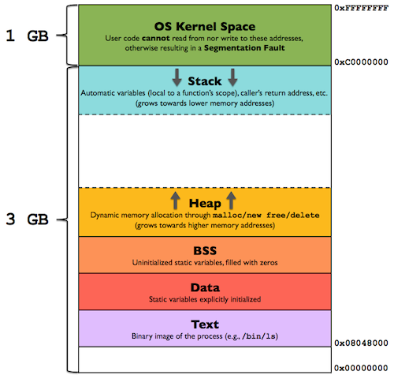

# ostep-address-spaces

## Historical evolution

OS + Single program | Batch processing | Time sharing

First try at interactivity: save full memory to disk -> too slow

Should leave all process in memory. Security problem, avoid cross program memory
access.

For devX the **address space** was created.

Basic three componentes of address space: code, stack and heap

Full image: 

Notice that the heap grows positively and stack negatively.

**Free data stays at the middle of the address memory, why?**

By separating stack and heap in this way it is possible for both of them to grow
without the need to reorganize the memory.

To solve this we have virtual memory, with virtual address. This way a program
thinks it is using address 0 when it is in fact being remaped by the OS to a
real physical address.

Goals of virtual memory:

1. transparency to the system
2. efficiency in time and space
3. protection (security)

## Exercises

Used `free` program. Interesting to note that the program displays free memory
not considering the kernel, in my system the kernel is occupying 1Gb of RAM.
